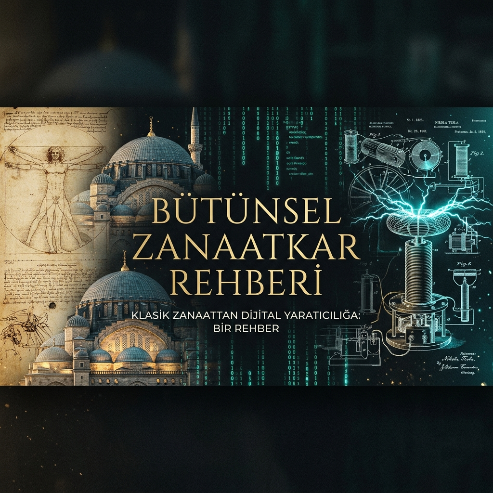

<p align="center">
  
</p>

# 🌐 Bütünsel Zanaatkar Rehberi (Holistic Artisan Roadmap)

> **"Gelişim = (Zihinsel Disiplin x Saha Pratiği)^Karakter Derinliği"**

Bu depo; teorik bilginin pratikle, zihinsel disiplinin mühendislikle ve vizyonun sahadaki terle birleştiği bir **üst-gelişim manifestosudur**. Modern çağın en büyük yanılgısı, "kişisel gelişim" ile "kariyer gelişimini" birbirinden ayrı kutulara hapsetmektir. Oysa bir zanaatkar için; **kendini inşa etmek, dünyayı inşa etmenin ön koşuludur.**

---

## 🏛️ Vizyon: Kendini İnşa Etmek, Dünyayı İnşa Etmektir

Bütünsel Zanaatkarlık (Holistic Craftsmanship), teknik bir yetkinlik setinden ziyade bir **varoluş biçimidir**. Biz inanıyoruz ki:
- **Karakterin derinliği yoksa, kodun derinliği de yoktur.**
- **Zihnini disipline edemeyen, karmaşık sistemleri yönetemez.**
- **Etik bir duruşu olmayan mühendislik, sadece bir yıkım aracıdır.**

Bu rehber, sizi sadece "daha iyi bir yazılımcı" veya "daha iyi bir mühendis" yapmayı değil; zihni, bedeni ve ruhu bir mühendislik hassasiyetiyle işleyen **Bütünsel İnsan'a** dönüştürmeyi amaçlar.

---

## 🏛️ Beş Büyük Usta: Ontolojik Sütunlar

### 1. 🏛️ Marcus Aurelius: Zihinsel İşletim Sistemi
"Karakterin temeli, zihnin sarsılmazlığıdır."

> "Zihniniz üzerinde gücünüz var, dış olaylar üzerinde değil. Bunu idrak ettiğinizde güç bulacaksınız."
>
> "Bir insanın hayatı, düşüncelerinin rengiyle boyanır. Öyleyse zihnini, sadece en saf ve en asil olanla doldur."
>
> "Sabah uyandığında kendine şunu söyle: Bugün karşılaşacağım insanlar şükürsüz, kaba, kıskanç ve bencil olacaklar. Bunların hepsi, iyilikle kötülüğü birbirinden ayıramadıkları için başlarına geliyor."

*   **Zanaat Aksiyonu:** Kariyerinizdeki engelleri (buglar, krizler, başarısızlıklar) karakterinizi test eden birer "simülasyon" olarak görün. Sükunet, en büyük teknik yetkinliktir.
*   [[Doktrin Detayları]](docs/01-philosophy/AURELIUS_DOCTRINE.md)

### 2. 👁️ Leonardo da Vinci: Bütünsel Görüş
"Dünya bir bütündür, parçalara bölmek sadece zayıflıktır."

> "Sanatın bilimini inceleyin. Bilimin sanatını inceleyin. Duyularınızı geliştirin, özellikle de görmeyi öğrenin. Her şeyin diğer her şeyle bağlantılı olduğunu idrak edin."
>
> "Bilmek yeterli değildir, uygulamalıyız. İstemek yeterli değildir, yapmalıyız."
>
> "Eksiksiz bir zihin için; her şeyi sorgulayan bir merak, her şeyi deneyen bir sabır gerekir."

*   **Zanaat Aksiyonu:** Kariyerinizdeki her teknik problem, kişisel hayatınızdaki bir analojiyle çözülebilir. Sistemleri bir bütün olarak görmeyi öğrenin.
*   [[El Kitabı Detayları]](docs/01-philosophy/DA_VINCI_HANDBOOK.md)

### 3. ⚡ Nikola Tesla: Zihinsel Simülasyon
"Gelecek, onu bugünden zihninde inşa edenlerindir."

> "Bırakın doğruları gelecek söylesin ve herkesi eserlerine ve başarılarına göre değerlendirsin. Bugün onların olsun; ama uğruna çok çalıştığım gelecek, benimdir."
>
> "Benim beynim sadece bir alıcıdır. Evrende, bilgiyi, gücü ve ilhamı ondan aldığımız bir çekirdek vardır."
>
> "Düşünmek bir zevktir, ama bir şeyi gerçekleştirmek bir ibadettir."

*   **Zanaat Aksiyonu:** Vizyonunuzu sadece kariyer hedefleriyle sınırlamayın. Zihninizde öyle bir gelecek tasarlayın ki, mevcut gerçeklik ona boyun eğmek zorunda kalsın.
*   [[Protokol Detayları]](docs/01-philosophy/TESLA_PROTOCOL.md)

### 4. 🏰 Mimar Sinan: Mimari Sağlamlık
"Temeli sarsılmaz olanın, zirvesi göğe ulaşır."

> "Ustamın eli altında, tıpkı bir pergelin sabit ayağı gibi kararlı ve sarsılmaz bir şekilde durup merkezi gözledim. Sonra pergelin hareketli ayağı gibi, başka diyarları gezmeye heveslendim."
>
> "Yaptığın işi gönlünde hissedersen, o iş seni sonsuzluğa taşır."
>
> "Bir yapının sağlamlığı, taşların birbirine duyduğu saygıdan gelir."

*   **Zanaat Aksiyonu:** Kariyerinizdeki "sabit ayak" etik değerleriniz ve karakterinizdir. Hareketli ayağınız ise sürekli öğrenen mühendislik ruhunuzdur.
*   [[Statik Detayları]](docs/01-philosophy/SINAN_STATICS.md)

### 5. 🐧 Linus Torvalds: Pragmatizm ve Gerçeklik
"Kod asla yalan söylemez, ama insanlar söyler."

> "Konuşmak bedavadır. Bana kodu göster." *(Talk is cheap. Show me the code.)*
>
> "Kötü programcılar kod için endişelenir. İyi programcılar ise veri yapıları ve onların arasındaki ilişkiler için endişelenir."
>
> "İtibar, ne yaptığınızla değil, neyi çalıştırmayı başardığınızla kazanılır."

*   **Zanaat Aksiyonu:** Kişisel gelişim kitapları okuyarak değil, en zorlu teknik problemleri çözerek karakterinizi inşa edin. İcraat, en büyük dürüstlüktür.
*   [[Manifesto Detayları]](docs/01-philosophy/TORVALDS_MANIFESTO.md)

---

## 📜 Zanaatkarın Manifestosu: Onur ve Teknik

1.  **Kendine Hükmet, Maddeye Hükmet:** Kendi zihnini fethetmeyen, karmaşık bir sistemi yönetemez.
2.  **Öğrenme Bir İbadettir:** Bilgiye erişmek bir haktır, ama onu işlemek bir onur meselesidir.
3.  **Radikal Dürüstlük:** Kodundaki hatayı saklayan, karakterindeki hatayı da saklar. Şeffaflık, ustalığın kapısıdır.
4.  **Estetik Bir Zorunluluktur:** Çirkin bir kod, zayıf bir zihnin dökümantasyonudur. Zerafet, sadeliktedir.
5.  **Miras Bilinci:** Biz sadece bugünün problemlerini çözmüyoruz; biz, bizden sonrakilerin üzerine inşa edebileceği bir temel bırakıyoruz.

---

## 🛰️ Uygulama Müfredatı (The Roadmap)

| Evre | Seviye | Odak | Ustalar | Kişisel Gelişim Hedefi |
| :--- | :--- | :--- | :--- | :--- |
| **Evre 1** | Tabula Rasa | C, Pointers, Memory | Aurelius, Torvalds | Sabır ve Öz-Disiplin |
| **Evre 2** | Connection | Linux, Networks, Shell | Da Vinci, Torvalds | Bütünsel Görüş (Sistem Düşüncesi) |
| **Evre 3** | Flow | Robotics, Control, AI | Tesla, Da Vinci | Derin Odaklanma ve Vizyonerlik |
| **Evre 4** | Mastery | Security, Cloud, Arch | Sinan, Tesla | Etik Liderlik ve Kalıcılık |

> [!TIP]
> Gelişiminizi teknik ve felsefi olarak nasıl ölçeceğinizi görmek için [Ustalık Matrisi'ni](docs/02-curriculum/MASTERY_MATRIX.md) inceleyin.

---

## 🧘 Günlük Zanaat Protokolü: Ruh ve Teknik Sentezi

1.  **Stoacı Sabah (07:00 - 08:00):** Meditasyon, günlük niyet belirleme ve günün en zorlu bug'ına zihinsel hazırlık.
2.  **Tesla Bloğu (08:00 - 12:00):** Derin odaklanma. Bildirim yok. Zihinsel simülasyon ve yoğun üretim.
3.  **Da Vinci Köprüsü (14:00 - 15:00):** Farklı disiplinler arası okumalar (Felsefe, Sanat, Biyoloji) ve teknik işe entegrasyon.
4.  **Sinan Denetimi (16:00 - 17:00):** İnşa edilen yapının (kod/sistem) sağlamlık ve güvenlik testi.
5.  **Torvalds PR (17:00 - 18:00):** İcraatın belgelenmesi, toplulukla paylaşılması ve radikal geri bildirim alma.

---

## 🧘 Kişisel Gelişim ve Öz-Ustalık (Self-Mastery)

Zanaatkarın en büyük projesi kendisidir. Kariyer gelişimi, kişisel gelişimden ayrı düşünülemez. Bu bölümde zihninizi ve bedeninizi en üst düzeye çıkaracak rehberler yer alır:

*   **[Monk Mode (Keşiş Modu)](docs/03-self-mastery/MONK_MODE.md):** Derin odaklanma ve radikal izolasyon protokolü.
*   **[Stoacı Egzersizler](docs/03-self-mastery/STOIC_EXERCISES.md):** Mühendislikte sarsılmazlık ve duygusal disiplin.
*   **[Sağlık ve Vitalite](docs/03-self-mastery/HEALTH_AND_VITALITY.md):** Yüksek performanslı zihin için biyolojik optimizasyon.
*   **[Zihinsel Modeller](docs/03-self-mastery/MENTAL_MODELS.md):** Problem çözme ve karar verme için bilişsel araç çantası.

---

## 📊 Aksiyon ve İlerleme: Tarihe Not Düşmek

Bu yolculukta attığınız her adım, kendi kişisel tarihinize düştüğünüz bir nottur.

*   **WEEK 01:** [Temel Atma Raporu](logs/weekly/WEEK_01_LOG.md)
*   **LOG Şablonu:** [Artisan Log Template](logs/LOG_TEMPLATE.md)

### 🛠️ Başlangıç
```bash
bash tools/setup_env.sh
```

---

## 🚀 Vizyon: Yolun Hakkını Vermek

Bu repo, "birkaç kod örneği" barındıran bir klasör değildir. Bu repo; kendini inşa etmeye karar vermiş, kariyerini bir zanaat, hayatını ise bir sanat eseri olarak görenlerin **karargahıdır**. Biz yola çıkarken; sadece yazılım yazmayı değil, **insanlık onurunu mühendislik dehasıyla birleştirmeyi** hedefledik.

> "Gelecek, onu bugünden zihninde inşa edenlerindir. Bugün onların olsun; ama uğruna çok çalıştığım gelecek, benimdir." — Nikola Tesla

---
*Bu rehber, teknik bir dökümandan ziyade, yaşayan bir mühendislik ruhudur. Kendini inşa etmeye hazır mısın?*